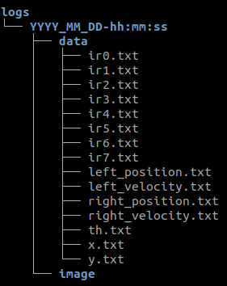

# Guide d'installation

### Prérequis :

* Pour la simulation, le logiciel [CoppeliaSim](https://www.coppeliarobotics.com/downloads)  (version EDU) pour linux.
```sh
$ # extraire le fichier
$ tar -xf CoppeliaSim_Edu_V4_0_0_Ubuntu18_04.tar.xz
$ # déplacement dans le dossier home/
$ mv CoppeliaSim_Edu_V4_0_0_Ubuntu18_04 ~
$ # lancement de l'application
$ ~/CoppeliaSim_Edu_V4_0_0_Ubuntu18_04/coppeliaSim.sh
```

* La librairie [Open CV](https://docs.opencv.org/2.4/doc/tutorials/introduction/linux_install/linux_install.html)
```sh
$ sudo apt-get install build-essential
$ sudo apt-get install cmake git libgtk2.0-dev pkg-config libavcodec-dev libavformat-dev libswscale-dev
$ # En option pour avoir opencv pour python 2
$ sudo apt-get install python-dev python-numpy libtbb2 libtbb-dev libjpeg-dev libpng-dev libtiff-dev libdc1394-22-dev
```

```sh
$ cd ~/opencv
$ mkdir release
$ cd release
$ cmake -D CMAKE_BUILD_TYPE=RELEASE -D CMAKE_INSTALL_PREFIX=/usr/local ..
```
L'étape suivante est celle qui prend le plus de temps:
```sh
$ make
$ sudo make install
```

### Installation

Télécharger le dossier directement depuis le site , ou le cloner en appliquant cette commande dans le terminal:

    $ git clone https://github.com/GuilainP/StageM1.git

Lancer CoppeliaSim et ouvrir la scène `e-puck.ttt` contenue dans le dossier StageM1/ 

Se rendre dans le dossier StageM1/build/ et faire les commandes suivantes:

    $ cmake ..
    $ make

Pour lancer l'application taper :

    $ ./apps/robot


Application : 

Un dossier est crée pour les données récoltées:



Cette application permet de faire bouger l' e-puck et de récolter les mesures des différents capteurs.

Pour arrêter le programme , taper ctrl + c dans le terminal.

L' e-puck de la scène a été modifié pour mieux correspondre au robot réel.
Vous avez la liberté de modifier la scène pour faire vos propres observations.


