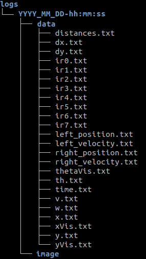

# Guide d'installation

### Prérequis :

* Pour la simulation, le logiciel [CoppeliaSim](https://www.coppeliarobotics.com/downloads)  (version EDU) pour linux.

    -extraire le fichier
        $ tar -xf CoppeliaSim_Edu_V4_0_0_Ubuntu18_04.tar.xz
    -déplacement dans le dossier home/
        $ mv CoppeliaSim_Edu_V4_0_0_Ubuntu18_04 ~
    -lancement de l'application
        $ ~/CoppeliaSim_Edu_V4_0_0_Ubuntu18_04/coppelia.sh

* La librairie [Open CV](https://www.learnopencv.com/install-opencv-4-on-ubuntu-18-04/)

* Le logiciel [CMake](https://cmake.org/)

### Installation

Télécharger le dossier directement depuis le site , ou le cloner en appliquant cette commande dans le terminal:

    $ git clone https://github.com/GuilainP/StageM1.git

Lancer CoppeliaSim et ouvrir la scène `e-puck.ttt` contenue dans le dossier StageM1/ 

Se rendre dans le dossier StageM1/build/ et faire les commandes suivantes:

    $ cmake ..
    $ make

Pour lancer l'application taper :

    $ ./apps/robot

Application : 

Un dossier est crée pour les données récoltées:

Cette application permet de faire bouger l' e-puck et de récolter les mesures des différents capteurs.

Pour arrêter le programme , taper ctrl + c dans le terminal.

    L' e-puck de la scène a était modifié pour mieux correspondre au robot réel.
    Vous avez la liberté de modifier la scène pour faire vos propres observation.

